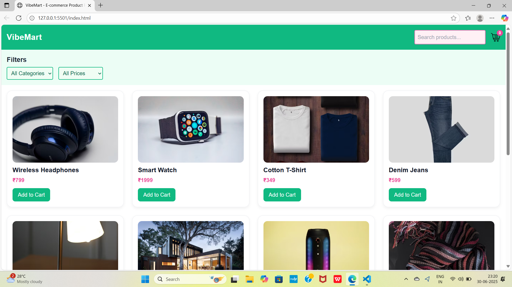

# 🛍️ E-commerce Product Page

This is a responsive E-commerce Product Page designed to simulate a basic online shopping experience. It displays a list of products with images, prices, and categories, along with filter and search functionality to enhance user interaction.

---

## 📌 What It Does

- Displays product cards with image, name, price, and category.
- Allows users to filter products by category and price.
- Includes a search bar for quick product lookup.
- Supports "Add to Cart" functionality (optionally stores cart in localStorage).

---

## 🔧 How It Works

- UI built using **Tailwind CSS** (or Bootstrap optionally).
- JavaScript handles search and filtering logic.
- (Optional) Cart data can be stored and retrieved from `localStorage`.

---

## 💡 Skills Gained

- Product card layout and responsive design
- DOM manipulation & filtering logic using JavaScript
- Working with `localStorage` to persist cart data
- Component-based frontend thinking

---

## 🎯 Goal

To build a functional and dynamic product page while learning how to create interactive, user-friendly web interfaces — a key skill in modern frontend development.

---

## 📷 Screenshot

---

## 📁 Files Included

| File/Folder           | Description                                        |
|-----------------------|----------------------------------------------------|
| `index.html`          | Main HTML page containing structure and content.  |
| `style.css`           | Custom styles and responsive design.              |
| `script.js`           | JavaScript logic for filtering/search/cart.       |
| `screenshots/`        | Contains a screenshot preview of the project.     |
| `README.md`           | This documentation file.                          |

---

## 🧑‍💻 Made By

**Parimala Jyothika** — CSE Student & Aspiring Frontend Developer

